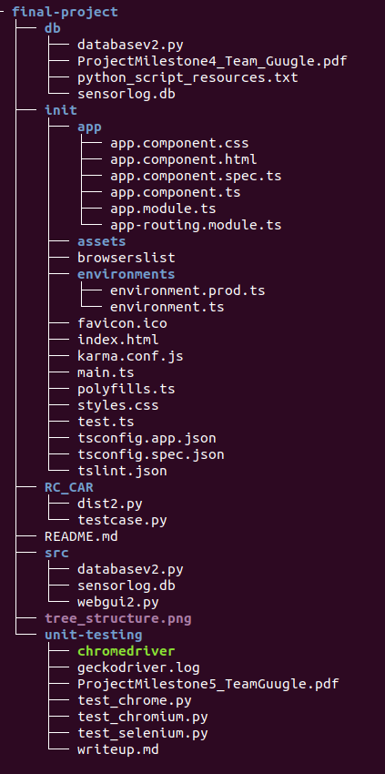

# FinalProject

An autonomous RC car controlled by a microcontroller (MSP432 or Raspberry Pi). The car will drive around on its own collecting sensor data (temperature data). Using our web interface, Temperature Logger, the device can amass large amounts of data and display them over long periods of time to give pertinent temperature information of an unknown room or area. This project in theory is related to the field of unmanned exploration.

## Repository Structure
* **bd** contains files used to create database and documentation
* **e2e**
* **init** contains an initial Angular version of the app we were working with. Had to change strategy once Pi needed to be connected, but kept source code. Can see init version [here](https://final-project-cs3308.herokuapp.com/)
* **RC_CAR** contains files for testing running RC car. [Video]()
* **src** contains the files referenced later in this README, source code of project
* **unit-testing** contains unit testing python scripts and documentation. 



## Development server
** Warning: This project will not be able to run without Raspberry Pi. Our TA, Ajay, is aware of this contingence and asked to not m ark points off if app tried to run without Pi**

Apache server will run once rasberry pie is turned on. 

## Connect the Raspberry Pi
Run:
```ssh pi@10.201.64.35```
Password: csci3308i

## Build

Code is in python.  Compile this code on bash via Rasberry Pie.

Databasev2.py builds the database script

Webgui2.py builds the web app and chart 

Make executable: chmod +x filename

Build code: ```python filename```

After these commands web app will be deployed 

## Running the Web App

Go to this link to build the web app once the server is running http://10.201.64.35/cgi-bin/webgui2.py

## Running unit tests
* The Selenium drivers for chrome and firefox, were downloaded [here](https://selenium-python.readthedocs.io/installation.html.) They've been provided in the unit-testing repo already.

Run: 
```python test_selenium.py```
```python test_chrome.py```

